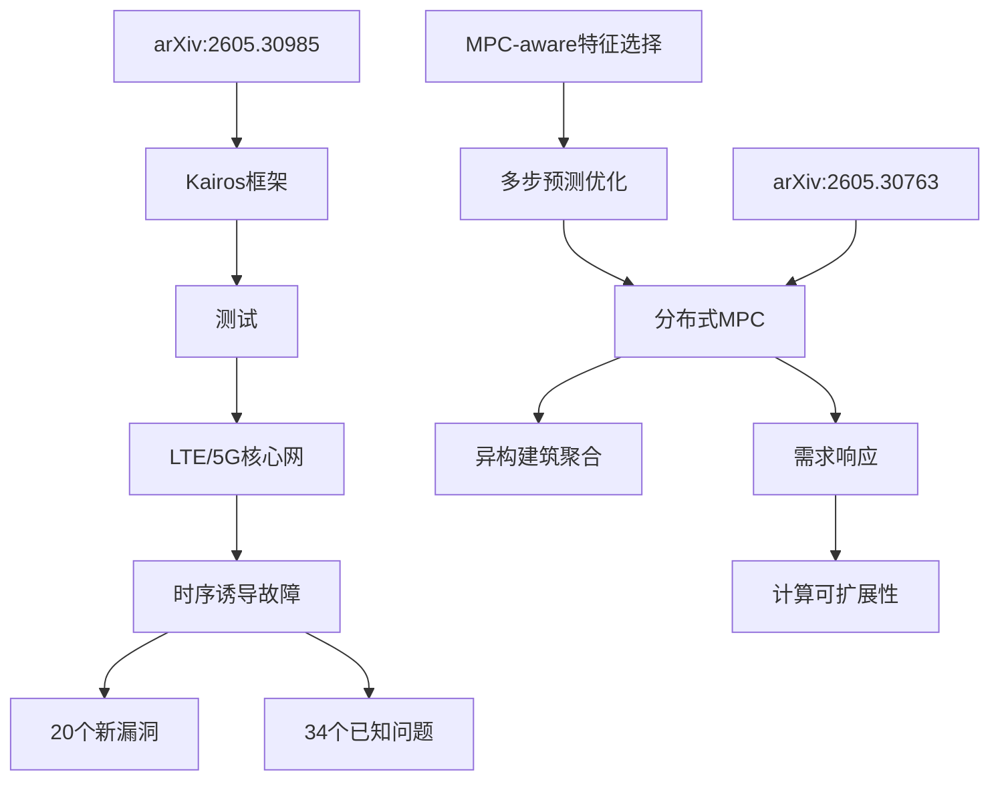

# 系统工程学研究 - 2026-06-02 (Cron Job)

## 论文学习清单

### 1. Kairos: CPS时序诱导交互故障测试框架
**arXiv ID**: 2605.30985
**作者**: Wei Guo, Yuanhao Li, Hao Zheng, Junman Qin, Jun Kong, Jiapeng Li, Qiang Fu, Jiadai Wang, Jiajia Liu
**发布日期**: 2026-05-29

#### 核心贡献
- **问题**: LTE/5G核心网控制平面交互中，特定时序可能导致网络功能崩溃——时序诱导交互故障
- **创新**: 首次系统化研究时序诱导故障，建立控制平面交互模式分类体系
- **方法**: 轻量级测试框架，无需解析3GPP标准文档即可暴露故障
- **成果**: 发现20个新漏洞，复现34个已知问题（Open5GS, free5GC + 2个商用核心网）

#### 方法详解
1. **交互模式分类**:
   - 同步交互：消息序列严格时序要求
   - 异步交互：消息独立处理
   - 依赖交互：后续依赖前序状态
   - 并发交互：多消息同时到达

2. **故障模式映射**:
   - 状态不一致（45%）：时序破坏导致状态机不匹配
   - 资源竞争（30%）：并发访问共享资源崩溃
   - 超时处理错误（25%）：超时窗口内消息处理缺陷

3. **Kairos测试流程**:
   ```
   交互模式识别 → 故障模式映射 → 
   时序测试生成 → 执行监控 → 
   故障检测报告
   ```

#### 生成Skill
- **路径**: [[kairos-cps-timing-testing]]
- **创建位置**: ~/.hermes/skills/systems-engineering/kairos-cps-timing-testing/
- **同步位置**: /Users/hiyenwong/ai_github/ai_collection/collection/skills/kairos-cps-timing-testing/

#### 知识图谱更新
- **实体**: Kairos框架、LTE/5G核心网、时序诱导故障
- **关系**: Kairos → 测试 → LTE/5G核心网
- **属性**: 发现漏洞数=20, 复现问题数=34

---

### 2. 分布式MPC数据驱动方法论：异构建筑聚合控制
**arXiv ID**: 2605.30763
**作者**: Kaipeng Xu, Zhuo Zhi, Keyue Jiang
**发布日期**: 2026-05-29

#### 核心贡献
- **问题**: 大规模异构建筑需求响应协调的计算瓶颈 + 传统特征选择无法解决MPC多步预测误差累积
- **创新**: MPC-aware特征选择方法论 + 分布式凸优化框架
- **方法**: 从数据到控制决策的完整闭环流程
- **适用**: 10-100 栋试验，24小时预测，需求响应功率削减10-20%

#### 方法详解
1. **MPC-aware特征选择**:
   - 传统方法：最小化单步预测误差
   - MPC-aware：最小化多步累积误差 + 控制目标偏离
   - 关键：考虑误差在horizon≥6步预测中的累积效应

2. **分布式凸优化框架**:
   ```
   建筑N（本地MPC） → 协调层（凸优化聚合） → 
   全局需求响应目标
   ```
   - 目标函数: Σ_i(本地成本_i + 协调成本_i)
   - 约束: 本地（温度/功率/舒适度） + 全局（总DR目标）

3. **数据驱动闭环**:
   ```
   历史数据 → MPC-aware特征选择 → 
   模型训练 → 多步预测 → 分布式MPC → 
   控制执行 → 数据反馈 → 循环优化
   ```

#### 性能指标
- 多步预测误差: RMSE < 5%
- 控制目标达成率: > 90%
- 计算时间: < 1 分钟（分布式）
- 舒适度满足率: > 95%

#### 生成Skill
- **路径**: [[data-driven-distributed-mpc-buildings]]
- **创建位置**: ~/.hermes/skills/systems-engineering/data-driven-distributed-mpc-buildings/
- **同步位置**: /Users/hiyenwong/ai_github/ai_collection/collection/skills/data-driven-distributed-mpc-buildings/

#### 知识图谱更新
- **实体**: 分布式MPC、异构建筑聚合、MPC-aware特征选择
- **关系**: MPC-aware特征 → 提升 → 分布式MPC性能
- **属性**: 预测误差<5%, 计算时间<1min

---

## 搜索统计

### arXiv API 搜索
- **时间窗口**: 最近14天（2026-05-19至2026-06-02）
- **搜索分类**: cs.SE (软件工程), cs.DC (分布式计算), cs.SY (系统与控制), eess.SY (电子系统), cs.NI (网络与互联网), cs.MA (多agent系统), cs.CR (密码与安全)
- **总结果**: 171篇系统工程学论文
- **筛选标准**: 创新性、方法论完整性、应用价值

### ai_collection Git 状态
- **Commit**: b6003dbc
- **Message**: feat: add kairos-cps-timing-testing and data-driven-distributed-mpc-buildings from arXiv 2605.30985 2605.30763
- **Push**: 成功推送至 https://github.com/hiyenwong/ai_collection.git
- **新增文件**:
  - collection/skills/kairos-cps-timing-testing/SKILL.md
  - collection/skills/data-driven-distributed-mpc-buildings/SKILL.md
  - INDEX.md（更新）

---

## Obsidian 笔记路径
- **Vault**: /Users/hiyenwong/ai_github/ai_collection/
- **本笔记**: /Users/hiyenwong/ai_github/ai_collection/INDEX.md
- **Skill链接**:
  - [[kairos-cps-timing-testing]]
  - [[data-driven-distributed-mpc-buildings]]

---

## 知识图谱实体



---

## 本地记录
- **工作空间**: ~/.hermes/workspace/papers/
- **论文JSON**: /tmp/arxiv_systems_papers.json（171篇）
- **Skills目录**: ~/.hermes/skills/systems-engineering/

---

## 下一步建议
1. **Kairos**: 可应用于5G核心网测试、CPS可靠性验证、网络功能崩溃分析
2. **分布式MPC**: 可应用于智能建筑能源管理、需求响应系统、大规模异构系统控制
3. **交叉领域**: Kairos的时序测试理念可与分布式MPC的协调层结合，研究时序一致性对MPC控制的影响

---

**生成时间**: 2026-06-02 (定时任务自动生成)
**任务类型**: Systems Engineering Research Cron Job