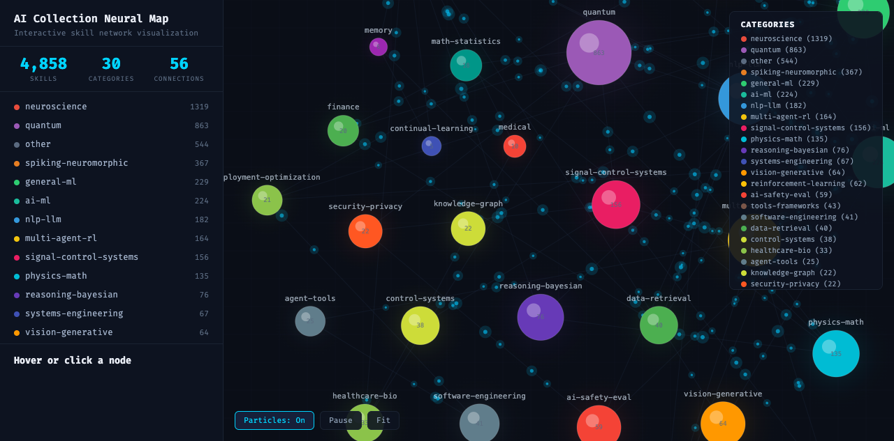

# OpenClaw AI Collection

[](https://opensource.org/licenses/MIT)
[](https://docs.openclaw.ai)
[](./collection/agents/)
[](./collection/skills/)
[](https://github.com/hiyenwong/ai_collection/graphs/contributors)
[](./CONTRIBUTING.md)

**[中文文档](./README_CN.md)** | **English**

A curated collection of **OpenClaw** agents and skills that provide powerful extensions for AI assistants.

## Table of Contents

- [Overview](#overview)
- [Features](#features)
- [Plugin Marketplace](#plugin-marketplace)
- [Agents](#agents)
- [Skills](#skills)
- [Quick Start](#quick-start)
- [Contributing](#contributing)
- [License](#license)

## Overview

This repository serves as a knowledge base and showcase for the OpenClaw agent and skill ecosystem. It documents agents and skills that extend OpenClaw's capabilities, making them easy to discover, understand, and use.

### What is OpenClaw?

OpenClaw is a flexible AI agent framework that supports:
- Multi-channel access (Feishu, Telegram, WhatsApp, etc.)
- Extensible skill system
- Autonomous sub-agents via `sessions_spawn`

### What are Agents?

**Agents** are autonomous AI assistants that execute specific tasks in isolated sessions, using different models and tools.

### What are Skills?

**Skills** are reusable capability packages that define specialized behaviors and tools, automatically activated by keywords.

## Features

- 🚀 **Plug and Play**: Agents and skills work out of the box
- 📚 **Well Documented**: Every component has detailed documentation
- 🔄 **Regular Updates**: New agents and skills added regularly
- 🤝 **Community Driven**: Community contributions welcome
- 🧪 **Tested**: Automated validation ensures quality

## Plugin Marketplace

Install agents and skills directly from Claude Code using the **Plugin Marketplace**:

```bash
# Add the marketplace
/plugin marketplace add hiyenwong/ai_collection

# Install specific plugins (choose by domain)
/plugin install openclaw-core@openclaw-ai-collection              # Core agents & meta-skills
/plugin install openclaw-neuroscience@openclaw-ai-collection      # Brain science & SNNs
/plugin install openclaw-coding@openclaw-ai-collection            # Development tools
/plugin install openclaw-data@openclaw-ai-collection              # Data science & ML
/plugin install openclaw-research@openclaw-ai-collection          # Applied science
```

**New to the marketplace?** See the complete implementation guide:
- 📖 [Marketplace Overview](docs/marketplace/README.md)
- 🎯 [Quick Start](docs/marketplace/QUICKSTART.md)
- 🔧 [Troubleshooting](docs/marketplace/TROUBLESHOOTING.md)

## Agents

| Agent | Function | Model | Status |
|-------|----------|-------|--------|
| [Fullstack Engineer](collection/agents/fullstack-engineer/) | Full-stack engineer for modern web development | Opus 4.5 / Sonnet 4.6 | ✅ |
| [Stock Analyst](collection/agents/stock-analyst/) | Stock analyst for financial data analysis | Sonnet 4.5 | ✅ |
| [Tech Co-Founder](collection/agents/tech-cofounder/) | Technical co-founder for product building | Sonnet 4.5 | ✅ |
| [Research Agent](collection/agents/research-agent/) | Research specialist for deep investigation | Opus 4.5 | ✅ |
| [Algorithm Engineer](collection/agents/algorithm-engineer/) | Algorithm engineer for design and optimization | Opus 4.5 | ✅ |
| [Applied Scientist](collection/agents/applied-scientist/) | Applied scientist for scientific principles | Opus 4.5 | ✅ |
| [Biologist](collection/agents/biologist/) | Biologist for biological systems and experiments | Opus 4.5 | ✅ |
| [Computational Scientist](collection/agents/computational-scientist/) | Computational scientist for numerical modeling | Opus 4.5 | ✅ |
| [Mathematician](collection/agents/mathematician/) | Mathematician for formal reasoning and proofs | Opus 4.5 | ✅ |
| [Neuroscientist](collection/agents/neuroscientist/) | Neuroscientist for neural mechanisms | Opus 4.5 | ✅ |
| [Philosopher](collection/agents/philosopher/) | Philosopher for conceptual analysis | Opus 4.5 | ✅ |
| [Psychologist](collection/agents/psychologist/) | Psychologist for cognitive behavior analysis | Opus 4.5 | ✅ |
| [Statistician](collection/agents/statistician/) | Statistician for statistical inference | Opus 4.5 | ✅ |

[View all 27 agents →](./collection/agents/)

## Skills

| Skill | Version | Function | Triggers | Status |
|-------|---------|----------|----------|--------|
| [Claude Code](collection/skills/claude-code/) | v2.1.71 | Anthropic's official coding companion with /loop, cron scheduling | claude-code | ✅ |
| [OpenCode](collection/skills/opencode/) | v1.2.21 | Open source AI coding agent with ultrawork mode | opencode, ultrawork | ✅ |
| [Copilot CLI](collection/skills/copilot-cli/) | v1.0.2 🎉 | GitHub Copilot CLI terminal agent, GA release! | copilot cli, github copilot | ✅ |
| [OpenSpec](collection/skills/openspec/) | - | Specification-driven development with Gherkin syntax | openspec, gherkin | ✅ |
| [AkShare](collection/skills/akshare/) | - | Chinese financial data interface | stock data, akshare | ✅ |
| [Stock Analysis](collection/skills/stock-analysis/) | - | Stock technical analysis with indicators | stock analysis, technical indicators | ✅ |
| [Consulting Report Search](collection/skills/consulting-report-search/) | - | Consulting and market research report search with iResearch-first ranking and QuestMobile secondary coverage | consulting report search, iresearch report, market research report | ✅ |
| [Skill Extractor](collection/skills/skill-extractor/) | - | Extract reusable skills from conversations | skill extractor | ✅ |
| [Security Guardrails](collection/skills/security-guardrails/) | - | Security protection against sensitive data leakage | Default for all agents | ✅ |
| [ICE Review](collection/skills/ice-review/) | - | Cross-task knowledge extraction with ICE strategy | ICE review, task review | ✅ |
| [Memory Retrieval](collection/skills/memory-retrieval/) | - | Two-stage memory retrieval with utility filtering | memory retrieval | ✅ |
| [Self-Challenge](collection/skills/self-challenge/) | - | Dual-agent self-challenge for capability expansion | self challenge | ✅ |
| [Cursor Rules Importer](collection/skills/cursor-rules-importer/) | - | Import cursor.directory rules into AgentSkills | cursor rules import, .cursorrules | ✅ |
| [React Components](collection/skills/react-components/) | - | React component architecture and best practices | react component, react hooks | ✅ |
| [Accessibility WCAG](collection/skills/accessibility-wcag/) | - | WCAG 2.2 accessibility compliance and patterns | accessibility, wcag, a11y, aria | ✅ |
| [Chrome Extension](collection/skills/chrome-extension/) | - | Chrome extension development with Manifest V3 | chrome extension, manifest v3 | ✅ |
| [Electron TypeScript](collection/skills/electron-typescript/) | - | Electron desktop app development with TypeScript | electron, desktop app, ipc | ✅ |
| [Frontend Best Practices](collection/skills/frontend-best-practices/) | - | Senior front-end developer guidance for React/Next.js | frontend, react, nextjs, tailwindcss | ✅ |
| [Neural Connectivity Matrix Viewer](collection/skills/neural-connectivity-matrix-viewer/) | - | Interactive 3D brain connectivity matrix visualization for EEG/MEG/fMRI | brain connectivity, matrix visualization, neural connectivity | ✅ |
| [Potassium Current Gain Control](collection/skills/potassium-current-gain-control/) | - | A-type potassium current mediated neuron gain control mechanism | IA current, gain control, divisive inhibition, subtractive inhibition | ✅ |
| [RNN Task Degradation Analysis](collection/skills/rnn-task-degradation-analysis/) | - | RNN weight initialization, solution diversity and degradation analysis | RNN initialization, degradation analysis, graceful degradation | ✅ |
| [Stochastic Synaptic Plasticity](collection/skills/stochastic-synaptic-plasticity/) | - | Stochastic models of neural synaptic plasticity with STDP rules | synaptic plasticity, STDP, plasticity kernel, Hebbian learning | ✅ |
| [Generative Brain Dynamics Models](collection/skills/generative-brain-dynamics-models/) | - | Generative models of brain dynamics review framework | brain dynamics, generative model, neural dynamics, computational neuroscience | ✅ |
| [Delay-Adaptive SNN Classifier](collection/skills/delay-adaptive-snn-classifier/) | - | Delay-adaptive spiking neural network classifier with conformal prediction reliability guarantees | SNN early stopping, delay-adaptive, conformal prediction | ✅ |
| [Noisy SNN Learning](collection/skills/noisy-snn-learning/) | - | Noise-driven spiking neural network learning framework exploiting noise as computational resource | noisy SNN, noise-driven learning, NSNN, NDL | ✅ |
| [Spiking Mode Neural Networks](collection/skills/spiking-mode-neural-networks/) | - | Spiking mode-based neural networks with Hopfield decomposition for reduced training cost | spiking mode, Hopfield decomposition, neural manifold | ✅ |
| [Neural Code Dynamics Analysis](collection/skills/neural-code-dynamics-analysis/) | - | Neural code dynamics analysis framework combining computational neuroscience, machine learning and critical brain theory | neural code, critical brain, representation manifold, representational drift | ✅ |
| [Linear Structure-Function Coupling](collection/skills/linear-structure-function-coupling/) | - | Linear generative framework for brain structure-function coupling predicting FC from SC | structure-function coupling, structural connectivity, functional connectivity, integrator hub | ✅ |
| [STDP Bernoulli Message Passing](collection/skills/stdp-bernoulli-message-passing/) | - | STDP-driven Bernoulli message passing spiking neural networks for Bayesian inference | STDP message passing, Bayesian inference, Bernoulli message, factor graph | ✅ |
| [Tsodyks-Markram Chaotic Dynamics](collection/skills/tsodyks-markram-chaotic-dynamics/) | - | Chaotic dynamics in Tsodyks-Markram short-term synaptic plasticity via Shilnikov homoclinic bifurcation | short-term synaptic plasticity, Tsodyks-Markram, Shilnikov bifurcation, chaotic dynamics | ✅ |
| [Spike Timing Neuronal Assemblies](collection/skills/spike-timing-neuronal-assemblies/) | - | STDP-driven formation and spontaneous reinforcement of neuronal assemblies with shared stimulus preferences | neuronal assembly, STDP, spike timing, noise correlation | ✅ |

[View all 2532 skills →](./collection/skills/)

### Version Check Feature

Each coding skill now includes **automatic version detection**. When your installed version differs from the documented version, you'll receive update suggestions with new feature highlights.

```
⚠️ Version Mismatch Detected

Your version: v2.0.50
Skill version: v2.1.71

Suggested action: npm update -g @anthropic-ai/claude-code

New features in v2.1.71:
  • /loop command - recurring prompts
  • Cron scheduling tools
  • Voice push-to-talk keybinding
```

## Quick Start

### Installation via Plugin Marketplace (Recommended)

```bash
# Add the marketplace
/plugin marketplace add hiyenwong/ai_collection

# Install the plugin you need
/plugin install openclaw-core@openclaw-ai-collection
```

### Manual Installation

```bash
# Clone the repository
git clone https://github.com/hiyenwong/ai_collection.git
cd ai_collection

# View available content
ls collection/agents/    # Available agents
ls collection/skills/    # Available skills
```

### Using Agents

```python
# Start an agent via sessions_spawn
sessions_spawn(
    task="Analyze stock data and generate a report",
    agentId="stock-analyst",
    model="claude-sonnet-4.5"
)
```

### Using Skills

Skills are automatically activated by keywords:

```
User: "Help me with stock analysis"
AI: [Detects "stock analysis" keyword, activates stock-analysis skill]

User: "Help me search consulting reports about AI marketing, prioritize iResearch"
AI: [Detects consulting report search intent, activates consulting-report-search skill]
```

### Adding a New Agent

1. Create directory at `collection/agents/your-agent-name/`
2. Copy `templates/agent-template.md`
3. Fill in agent details and capabilities
4. Add examples and usage instructions
5. Update [AGENTS.md](./AGENTS.md)

### Adding a New Skill

1. Create directory at `collection/skills/your-skill-name/`
2. Copy `templates/skill-template.md`
3. Define skill description, triggers, and behavior
4. Add references, examples, and scripts
5. Update [SKILLS.md](./SKILLS.md)

## Project Structure

```
ai_collection/
├── README.md              # This file (English)
├── README_CN.md           # Chinese documentation
├── CHANGELOG.md           # Version history and notable changes
├── AGENTS.md              # Agent documentation index
├── SKILLS.md              # Skill documentation index
├── INDEX.md               # Category index
├── CONTRIBUTING.md        # Contribution guide (includes skill category rules)
│
├── docs/                  # General documentation
│   ├── agents/            # Agent guides and best practices
│   ├── skills/            # Skill guides and best practices
│   └── integration/       # Integration documentation
│
├── collection/            # Collected agents and skills
│   ├── agents/            # Agent packages (27 agents)
│   └── skills/            # Skill packages (31 category subdirectories)
│       ├── neuroscience/          # Brain, EEG, cognitive science
│       ├── quantum/               # Quantum computing, quantum ML
│       ├── spiking-neuromorphic/  # SNNs, neuromorphic computing
│       ├── ai-ml/                 # General AI/ML
│       ├── general-ml/            # ML/DL concepts, training
│       ├── nlp-llm/               # Language models, transformers
│       ├── multi-agent-rl/        # Multi-agent, reinforcement learning
│       ├── signal-control-systems/ # Signal processing, control
│       ├── physics-math/          # Physics-informed ML, math
│       └── ... 22 more categories
│
├── knowledge/             # AI learning knowledge base
│   ├── arxiv/             # arXiv paper learning notes
│   └── skills/            # Learned skills documentation
│
├── templates/             # Templates for new items
│   ├── agent-template.md
│   └── skill-template.md
│
└── scripts/               # Utility scripts
    ├── classify_skills.py # Auto-classify skills into categories
    ├── validate_skill.py  # Validate SKILL.md format
    └── ...                # Migration, monitoring, deployment scripts
```

### Skill Category System

Skills are organized into **31 category subdirectories**. New skills MUST be placed in `collection/skills/<category>/<skill-name>/`, never in the root skills directory. See [CONTRIBUTING.md](./CONTRIBUTING.md#skill-categories) for the full category list and selection rules.

**Enforcement policy:** All PRs containing new skills are reviewed before merge. Any skill found in the root `collection/skills/` directory (not in a category subdirectory) will block the merge. The reviewer will run `python scripts/classify_skills.py` to auto-classify, verify 0 flat skills remain, then merge.

To auto-classify flat skills into categories:
```bash
python scripts/classify_skills.py
```

### Neural Network Skill Map

The skill collection is visualized as an interactive **neural network** where each category is a node (sized by skill count), connected to related domains with animated signal particles flowing along the edges.



**Open the interactive version:** [docs/html/skill-neural-map.html](./docs/html/skill-neural-map.html) (open in a browser)

Features:
- **30 category nodes** positioned in a force-directed circular layout
- **Animated particles** flowing along inter-category connections
- **Click a node** to highlight its connections and dim unrelated nodes
- **Sidebar** with category list, skill counts, and detail panel
- **Legend** showing all categories with their colors
- **Controls**: toggle particles, pause animation, reset layout

To regenerate the map after adding/removing skills:
```bash
python scripts/update_neural_map.py
```

This script scans `collection/skills/` and updates the skill counts in the HTML file. It should be run whenever skills are added, removed, or reclassified.

## Knowledge Base

The `knowledge/` directory contains AI self-evolution learning materials:

### arXiv Papers (7 papers)

Topics covered:
- **Spiking neural networks** - SNN classifiers, learning frameworks, neural code dynamics
- **Brain dynamics** - Generative models, structure-function coupling
- **Neuroscience** - Neural connectivity, synaptic plasticity, Tsodyks-Markram dynamics
- **Working memory** - Heterogeneous delays, recurrent spiking networks
- **Self-evolution** - Agent self-improvement and meta-cognition

### Skills Converted (2 skills)

Papers converted to practical OpenClaw skills:
- See `knowledge/skills/` directory

See [knowledge/arxiv/index.json](./knowledge/arxiv/index.json) for the full paper index.

## Documentation

- [Agents Overview](./AGENTS.md) - Learn about OpenClaw agents
- [Skills Overview](./SKILLS.md) - Learn about OpenClaw skills
- [Category Index](./INDEX.md) - Browse by category
- [Agent Creation Guide](./docs/agents/creation-guide.md) - How to create agents
- [Skill Creation Guide](./docs/skills/creation-guide.md) - How to create skills

## Tech Stack

- **AI Models**: Claude (Opus, Sonnet, Haiku)
- **Framework**: OpenClaw
- **Languages**: Python, JavaScript/TypeScript
- **Tools**: Git, npm, uv, ruff, pytest

## Contributing

Contributions are welcome! Please see the [Contributing Guide](./CONTRIBUTING.md) for details.

### Quick Contribution

1. Fork this repository
2. Create a feature branch (`git checkout -b feat/AmazingFeature`)
3. Commit your changes (`git commit -m 'feat: add amazing feature'`)
4. Push to the branch (`git push origin feat/AmazingFeature`)
5. Create a Pull Request

## Roadmap

### V1 (Completed) ✅
- Basic agent and skill collection
- Documentation and templates
- Validation scripts

### V2 (In Progress) 🚧
- More domain agents
- Skill marketplace
- Performance optimization

### V3 (Planned) 📋
- Web UI
- CLI tools
- Package manager

## About OpenClaw

OpenClaw is a flexible AI agent framework supporting multi-channel access, extensible skills, and autonomous sub-agents.

- **Documentation**: https://docs.openclaw.ai
- **GitHub**: https://github.com/openclaw/openclaw
- **Community**: https://discord.com/invite/clawd

## License

This repository is licensed under MIT License. Individual agents and skills may have their own licenses.

## Acknowledgments

Thanks to all developers who have contributed to this project!

## Contact

- GitHub Issues: [Submit an issue](https://github.com/hiyenwong/ai_collection/issues)
- Email: hiyenwong@gmail.com
- Discord: [OpenClaw Community](https://discord.gg/clawd)

---

Maintained by the OpenClaw Community 🤖

<a href="https://www.star-history.com/?repos=hiyenwong%2Fai_collection&type=date&legend=top-left">
 <picture>
 <source media="(prefers-color-scheme: dark)" srcset="https://api.star-history.com/image?repos=hiyenwong/ai_collection&type=date&theme=dark&legend=top-left" />
 <source media="(prefers-color-scheme: light)" srcset="https://api.star-history.com/image?repos=hiyenwong/ai_collection&type=date&legend=top-left" />
 
 </picture>
</a>