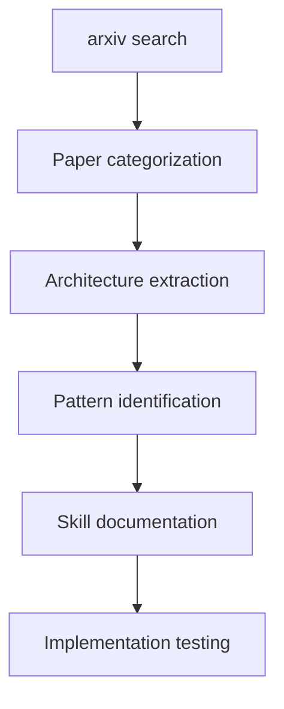
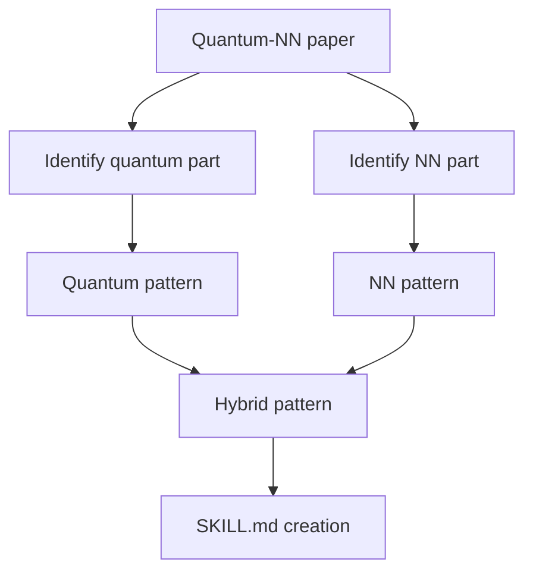

# Quantum-Neural Network Cross-Domain Research Skill

Cross-disciplinary research skill combining quantum computing principles with neural network architectures to design and analyze hybrid quantum-classical models.

## Description

Bridges quantum computing and neural network domains by:
- Analyzing quantum algorithms for neural network training
- Designing variational quantum circuits (VQC) as neural network layers
- Evaluating quantum advantage in deep learning tasks
- Extracting patterns from quantum-ML research papers

## Activation Keywords

- quantum neural network
- 量子神经网络
- quantum deep learning
- hybrid quantum-classical
- quantum ML
- variational quantum circuits
- VQC neural network
- quantum algorithm training
- 量子机器学习
- quantum-graph neural network

## Recommended Model

- **opus4.5** (For complex cross-domain analysis)
- **sonnet4.5** (For standard quantum-NN research)

## Tools Used

- **arxiv-search**: Search quantum-ML papers from arXiv
- **read**: Load quantum computing theory, neural network papers
- **write**: Document analysis findings, create skill patterns
- **exec**: Run quantum simulation scripts (Qiskit, PennyLane)
- **memory**: Store quantum-NN patterns and insights

## Usage Patterns

### Pattern 1: Literature Review
```
搜索量子神经网络相关论文并分析
```

### Pattern 2: Architecture Design
```
设计一个量子-经典混合神经网络架构
```

### Pattern 3: Quantum Advantage Analysis
```
分析量子计算在神经网络训练中的优势
```

### Pattern 4: Pattern Extraction
```
从量子-神经网络交叉研究中提炼可复用模式
```

## Instructions for Agents

### Step 1: Literature Search

1. **Search arxiv** for recent quantum-ML papers:
   ```python
   keywords = [
       "quantum neural network",
       "variational quantum circuits",
       "quantum deep learning",
       "hybrid quantum-classical",
       "quantum graph neural network"
   ]
   ```

2. **Categorize papers** by:
   - Architecture type (VQC-based, quantum-enhanced, hybrid)
   - Application domain (optimization, classification, generation)
   - Quantum advantage type (speedup, expressibility, entanglement)

3. **Extract key findings**:
   - Novel quantum architectures
   - Training algorithms
   - Benchmark results
   - Limitations and challenges

### Step 2: Architecture Analysis

Analyze quantum-NN architectures:

1. **Variational Quantum Circuits (VQC)**:
   - Parameterized quantum gates as weights
   - Measurement as activation
   - Cost function encoding

2. **Quantum-Classical Hybrid**:
   - Quantum feature maps → Classical NN
   - Classical optimization → Quantum circuits
   - Layer-wise quantum operations

3. **Quantum Graph Neural Networks**:
   - Entanglement-based message passing
   - Superposition for node representations
   - Quantum walks on graphs

### Step 3: Pattern Extraction

Extract reusable patterns:

1. **Encoding Pattern**:
   - How classical data maps to quantum states
   - Amplitude encoding vs basis encoding
   - Feature map design

2. **Training Pattern**:
   - Parameter shift rule for gradients
   - Quantum-aware optimizers
   - Measurement-based loss functions

3. **Hybrid Pattern**:
   - Quantum layer placement in classical NN
   - Data flow between quantum and classical
   - Entanglement vs locality trade-offs

### Step 4: Skill Creation

Convert patterns to skills:

1. **Document patterns** with:
   - Mathematical formulations
   - Implementation pseudocode
   - Use case examples

2. **Create skill structure**:
   ```
   quantum-nn-{pattern-name}/
   ├── SKILL.md
   ├── examples/
   ├── references/
   └── scripts/
   ```

3. **Test patterns** with:
   - Simple quantum circuits (Qiskit)
   - Toy neural network tasks
   - Benchmark datasets

## Key Concepts

### Quantum Advantage Types

| Type | Description | Example |
|------|-------------|---------|
| **Expressibility** | Larger Hilbert space capacity | Quantum feature maps |
| **Entanglement** | Correlation encoding | Quantum message passing |
| **Superposition** | Parallel processing | Quantum convolution |
| **Speedup** | Computational complexity | Quantum optimization |

### Architecture Patterns

| Pattern | Quantum | Classical | Application |
|---------|---------|-----------|-------------|
| **VQC-NN** | Full quantum circuit | Parameter optimization | Classification |
| **QNN-Classical** | Quantum features | Classical layers | Feature extraction |
| **Hybrid-Layer** | Quantum layers | Classical layers | Sequential models |
| **Quantum-GNN** | Entangled operations | Graph structure | Graph learning |

### Key Papers

1. **"A quantum algorithm for training wide and deep classical neural networks"** (Zlokapa et al., 2021)
   - Quantum speedup in gradient descent
   - Hamiltonian simulation approach

2. **"A neural network oracle for quantum nonlocality problems in networks"** (Kriváchy et al., 2019)
   - NN solving quantum nonlocality
   - Network Bell inequalities

3. **"Variational quantum classifiers"** (Schuld et al., 2020)
   - VQC as quantum classifiers
   - Feature map design patterns

## Implementation Examples

### Example 1: VQC Layer

```python
import pennylane as qml

def quantum_neural_layer(weights, data):
    """Variational quantum circuit as neural network layer"""
    
    # Encoding: classical data to quantum state
    for i in range(n_qubits):
        qml.RX(data[i], wires=i)
    
    # Variational: parameterized gates (weights)
    for i in range(n_qubits):
        qml.RY(weights[i], wires=i)
        qml.RZ(weights[i+n_qubits], wires=i)
    
    # Entangling: quantum correlations
    for i in range(n_qubits-1):
        qml.CNOT(wires=[i, i+1])
    
    # Measurement: quantum to classical
    return [qml.expval(qml.PauliZ(i)) for i in range(n_qubits)]
```

### Example 2: Quantum Feature Map

```python
def quantum_feature_map(x, n_qubits):
    """Encode classical features into quantum Hilbert space"""
    
    # Amplitude encoding
    state = np.zeros(2**n_qubits)
    state[:len(x)] = x
    state = state / np.linalg.norm(state)
    
    # Create quantum circuit
    dev = qml.device('default.qubit', wires=n_qubits)
    
    @qml.qnode(dev)
    def circuit():
        qml.AmplitudeEmbedding(state, wires=range(n_qubits))
        return qml.state()
    
    return circuit()
```

### Example 3: Hybrid Quantum-Classical NN

```python
import torch
import pennylane as qml

class QuantumNeuralNetwork(torch.nn.Module):
    """Hybrid quantum-classical neural network"""
    
    def __init__(self, n_qubits):
        super().__init__()
        self.n_qubits = n_qubits
        
        # Classical pre-processing
        self.pre_classical = torch.nn.Linear(input_dim, n_qubits)
        
        # Quantum layer
        self.quantum_weights = torch.nn.Parameter(
            torch.randn(2 * n_qubits)
        )
        
        # Classical post-processing
        self.post_classical = torch.nn.Linear(n_qubits, output_dim)
    
    def forward(self, x):
        # Classical → Quantum → Classical
        x = self.pre_classical(x)
        x = quantum_layer(self.quantum_weights, x)
        x = self.post_classical(x)
        return x
```

## Research Workflow

### Literature Analysis Workflow



### Pattern Extraction Workflow



## Error Handling

### Quantum Simulation Errors
```
If quantum circuit fails:
  1. Check qubit count vs feature dimensions
  2. Validate encoding method compatibility
  3. Simplify circuit depth gradually
  4. Use noise-free simulation first
```

### Pattern Extraction Errors
```
If pattern unclear:
  1. Review mathematical formulations
  2. Check for implicit assumptions
  3. Ask domain experts (or use memory)
  4. Focus on single component first
```

## Best Practices

1. **Start Small**: Test with simple 2-4 qubit circuits
2. **Validate Encoding**: Ensure data fits quantum state space
3. **Compare Classical**: Benchmark against pure classical NN
4. **Document Trade-offs**: Quantum advantage vs complexity
5. **Track Limitations**: Noise, decoherence, gate errors

## Resources

### Quantum Computing Frameworks
- **Qiskit**: IBM quantum framework
- **PennyLane**: Quantum ML library
- **Cirq**: Google quantum framework
- **TensorFlow Quantum**: Google quantum-NN

### Key Papers
- arXiv:2107.09200 - Quantum algorithm for training classical NN
- arXiv:1907.10552 - Neural network oracle for quantum nonlocality
- arXiv:2009.01792 - Variational quantum classifiers

### Related Fields
- Quantum information theory
- Machine learning theory
- Graph neural networks
- Optimization theory

## Related Skills

- **neural-dynamics-universal-translator**: Neural dynamics analysis
- **gnn-transformer-fusion**: GNN architecture design
- **skill-extractor**: Pattern extraction from papers
- **arxiv-search**: Literature search

## Limitations

- Requires quantum computing background
- Limited to theoretical analysis without hardware
- Pattern extraction depends on paper quality
- Quantum advantage not always clear
- Simulation vs real hardware gap

## Notes

- This skill bridges two complex domains
- Focus on theoretical patterns first
- Use simulation for validation
- Extract mathematical formulations carefully
- Document quantum-classical interface clearly

## Examples

### Basic Quantum Neural Network Crossing usage
```
User: "Help me with quantum neural network crossing"
→ Understand requirements → Execute actions → Provide results
```

### Advanced usage
```
User: "I need detailed quantum neural network crossing assistance"
→ Clarify scope → Provide comprehensive solution → Follow up
```
